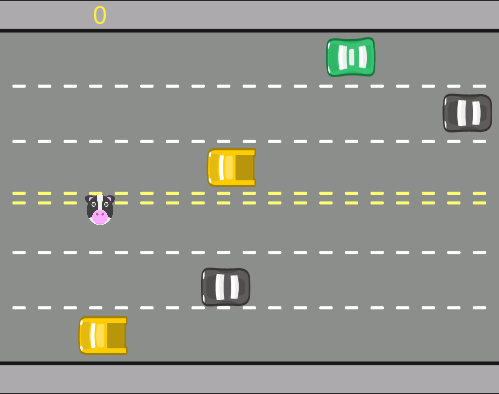

<h1>Freeway</h1>

Esse projeto foi inspirado no game <strong>Freeway</strong> lançado para Atari 2600.

<h1 align="center" >
  
</h1>

---
Jogue online clicando [aqui](https://editor.p5js.org/lucasfraza0/present/4nyoDapbG) 🕹.

## 🎯 Como contribuir
Se quiser contribuir com esse projeto, seja corrigindo problemas, adicionando comentários ou melhorando a documentação, você pode seguir os passos abaixo:
* Faça [um fork](https://help.github.com/pt/github/getting-started-with-github/fork-a-repo) desse repositório;
* Crie uma nova branch com as suas alterações: `git checkout -b my-feature`
* Salve as alterações e crie uma mensagem de commit contando o que você fez: `git commit -m "feature: My new feature"`
* Envie as suas alterações: `git push origin my-feature`

## 📝 Licença
Este projeto está sob a licença MIT.

Feito por [Lucas Frazão](https://www.linkedin.com/in/lucas-frazaao/) 👋🏻.
